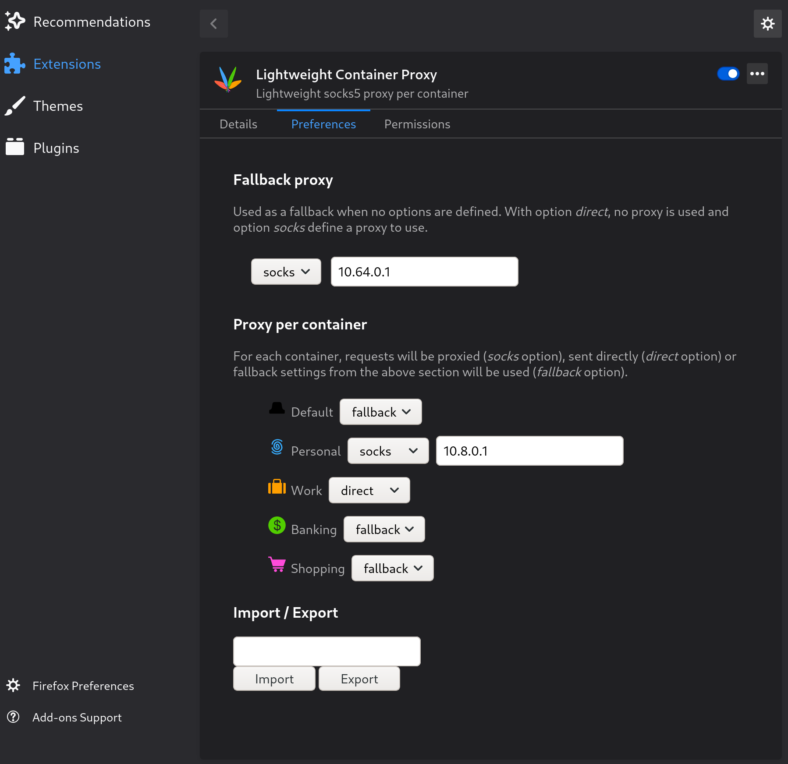

  

# Lightweight Container Proxy

This firefox addon will, for each [tab container](https://addons.mozilla.org/en-GB/firefox/addon/multi-account-containers/) optionally redirect redirect traffic through a socks5 proxy.

The aim is to keep the code small to ease inspection. Have a look at the code yourself!

## Permission Request Explanations

- `Access your data for all websites` is required to proxy every request based on the container they originate from.
- `Control browser proxy settings` is required to set proxy  settings on the fly for each request.

## Acknowledgements

- [github.com/jonathanKingston/containers-https](https://github.com/jonathanKingston/containers-https), used as a starting point
- [Vector clip art of four crossed color feathers](https://publicdomainvectors.org/en/free-clipart/Vector-clip-art-of-four-crossed-color-feathers/31643.html) (public domain), as a base for the logo
